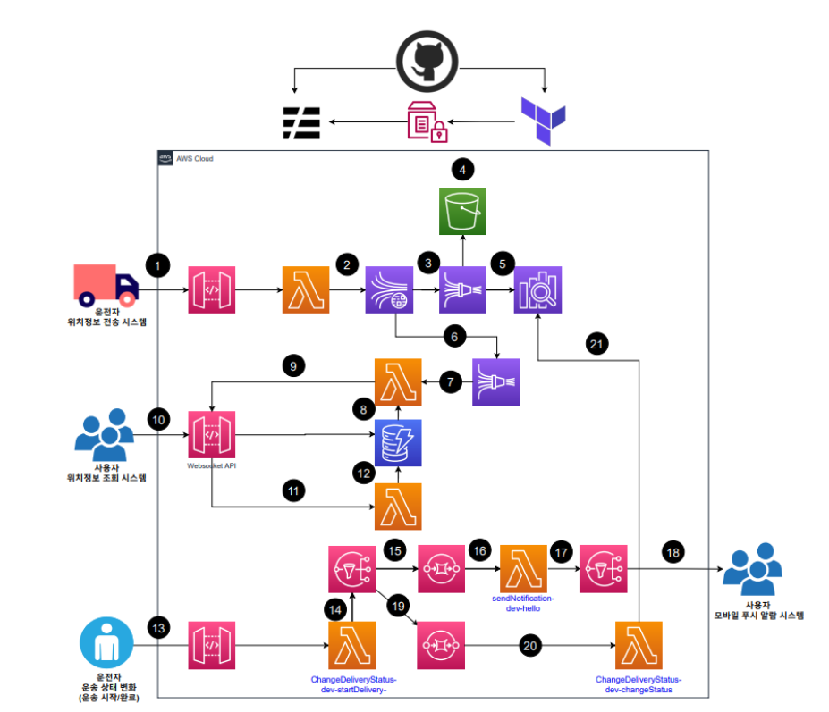
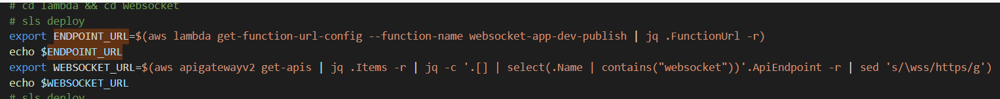

# Real-Time Freight Tracking System + Mobile Push Notification Architecture

> **Sendy** is Korea's No.1 freight booking service. After a successful reservation, customers should be able to track the driver’s real-time location throughout the delivery process.

## Project Overview

This project enables customers to track their cargo delivery in real-time after matching with a driver. It supports WebSocket-based live updates and push notifications for delivery status changes.

Key goals included:
- Customers must receive real-time location data for the matched driver after booking.
- A separate driver-only app should transmit location data in JSON format as a stream.
- Consider using Kinesis Data Stream and Kinesis Data Firehose for handling the stream.
- Log location information via Elasticsearch (OpenSearch).

## AWS Architecture

### Detailed Architecture Flow (Live Tracking):
1. Driver clicks "Start Location Sharing" → sends current location to API Gateway.
2. API Gateway forwards location data to Kinesis Data Stream.
3. Kinesis Data Stream forwards the data to Firehose A (connected to OpenSearch).
4. Firehose A stores backup logs in S3.
5. Firehose A also sends logs to OpenSearch for indexing.
6. At the same time, Kinesis Data Stream sends the same data to Firehose B (connected to Lambda).
7. Firehose B triggers a Lambda function for real-time data handling.
8. Lambda queries DynamoDB to check if a WebSocket connection exists for the given truck ID.
9. If a connection exists, Lambda sends the location data to the user via WebSocket API.
10. The customer views real-time truck location updates through the WebSocket.
11. When a user starts or stops tracking, the WebSocket is opened or closed accordingly.
12. When a WebSocket connection opens, the system stores the connection ID and truck ID in DynamoDB. When it closes, the entry is deleted.

### Push Notification Flow (Status Change):

13. Driver presses a button to change delivery status → sends data to API Gateway.
14. API Gateway invokes a Lambda to process the status update.
15. Lambda publishes a message to SNS.
16. SNS pushes the message to:
    - SQS A → triggers Lambda A to send mobile/email push notifications.
17. Lambda A publishes a message to SNS for downstream delivery.
18. SNS sends out the notification to the user (currently via email).
19. SNS also pushes the message to SQS B → triggers Lambda B.
20. Lambda B updates the delivery status in the OpenSearch index.
21. The status log is now available for search and monitoring in OpenSearch.

## Technologies Used

- **Backend/Architecture**: AWS Lambda, API Gateway, Kinesis Stream/Firehose, DynamoDB, OpenSearch
- **Messaging**: SNS, SQS
- **Frontend Interface**: WebSocket API
- **Infrastructure as Code**: Terraform, Serverless Framework
- **CI/CD**: GitHub Actions, Shell Script (for sequencing)
- **Monitoring/Logging**: CloudWatch, OpenSearch
- **Languages**: Python, Shell

## Architectural Decisions

After evaluating multiple options, the final design chose to directly connect **Kinesis Firehose → Lambda → WebSocket API** instead of using OpenSearch as a buffer.

### Why?

- Lambda-based routing offers lower latency and simpler logic than querying OpenSearch.
- Serverless structure fits well with Kinesis Firehose → Lambda pipeline.
- Querying OpenSearch with polling or webhooks introduced unnecessary delay and cost.

We used **DynamoDB** to manage open WebSocket connections and track which clients are listening to which truck IDs in real time.

## CI/CD Strategy

- Used **GitHub Actions** for deployment automation.
- **Lambda functions** managed with Serverless Framework.
- **Infrastructure** like Kinesis/SQS/SNS managed via Terraform.
- To handle deployment order (e.g., Lambda URL needed before Firehose config), we:
  - Extracted Lambda URL using AWS CLI.
  - Wrote a shell script to deploy Serverless first, then apply Terraform.

## 🧩 Key Challenges & Solutions

| Challenge | Solution |
|----------|----------|
| Deployment order between Serverless and Terraform | Used shell script to orchestrate CLI-based staged deployment |
| Mapping Lambda URL into Firehose HTTP destination | Extracted URL via CLI and injected it using `terraform apply -var` |
| Real-time connection filtering | Used DynamoDB lookups for WebSocket connections and active truck mapping |

## 📈 Lessons Learned

As a DevOps-focused engineer, I realized that **architecture decisions drive success**. Theoretical designs that look great on paper may introduce latency, cost, or management complexity. The best architecture balances simplicity, scalability, and reliability.

**Key Takeaways**:
- Serverless + Kinesis is powerful for real-time stream processing.
- Direct WebSocket push beats polling for instant feedback.
- CI/CD across multiple IaC tools (Terraform + Serverless) must consider dependency order.

## Related Technologies & Concepts
- Kafka – Evaluated for large-scale stream processing
- Kubernetes – Explored as a future option for container orchestration and scaling
- Jenkins – Considered for legacy CI workflows
---

